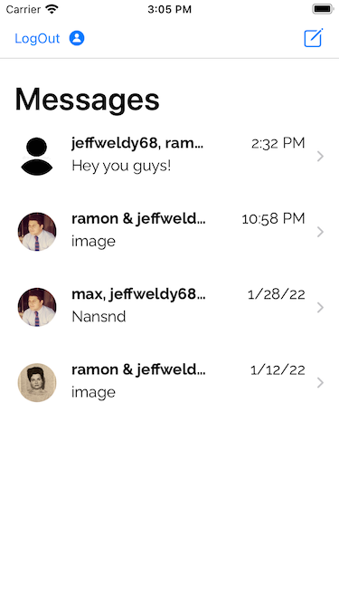
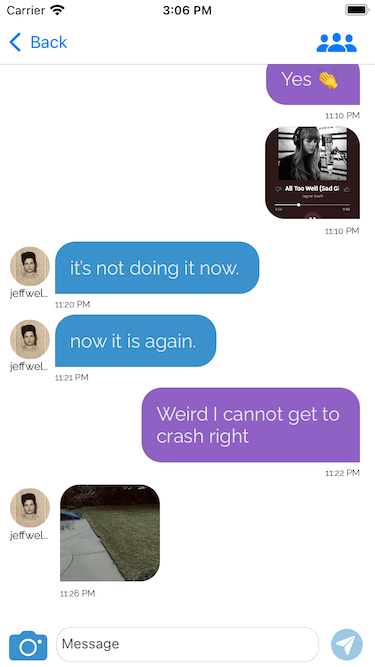
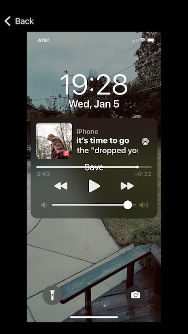
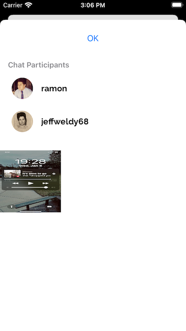

## DareChat app

### App Description
**DareChat** is an app that allows users to create group and individual chats. It allows you to send images and text. Also, it allows you to save images of chats on the phone.

I created this app as my final project for Udacity's iOS nanodegree. It can be used as a template for chat features for other apps. The app uses Core Data and Firebase. The intended user is anyone who wants to play around with a chat app. 

## Installation 

Clone the GitHub repository. 

`$ git clone https://github.com/ryepez/funChat.git`

### Environment

#### DareChat was developed on the following environment: 

* XCode 13.1
* Swift 5.0
* iOS 15.0

#### Cocoa Pods

Therefore, install `pod install` CocoaPods before running the project. After installing CocoaPods open the project using `Itch.xcworkspace`.

### Libraries: 
* firebase 
* FirebaseStorageUI

## Usage 
To use, just download the app from this repository. To access the app you will need to create an account (which can be done on the Welcome page). After that, you will be able to send messages to anyone on the app.
___
### Sign Up Screen   
       

Sign Up screen to login or create an account.

### Welcome Screen      

On the welcome screen you can see the channels that you are part of. Also you can create new ones by pressing on the top-right button.               
### Chat

This a screenshot of the look of the chat.
### Create Chat 

On this screen, you can create new chats.
### Save image to Core Data

To save an image in Core Data place your finger on the screen on the image that you
want to save and hold for a few seconds. After a moment, the word, "save" will appear. 
Press on "save" and you're done! 
### Images saved 

You can see the saved images on this screen as seen above.

## Maintainers
@ryepez
