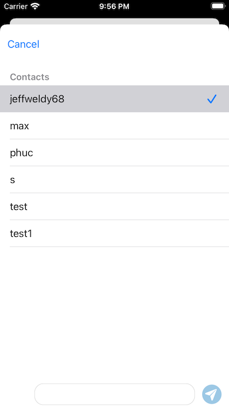

## DareChat app

### App Description
**DareChat** is an app that allow users to create group and individual chats. The allow you to send images and text. Also, it allow you to save images of chat on the phone.

I create this app as my final project for Udacity's iOS nanodegree. It can be use as template for chat feature for other apps. The app uses Core Data, and Firebase. The intended user is anyone that want to play around with a chat app. 

## Installation 

Clone the GitHub repository. 

`$ git clone https://github.com/ryepez/funChat.git`

### Environment

#### DareChat was developed on the following environment: 

* XCode 13.1
* Swift 5.0
* iOS 15.0

#### Cocoa Pods

Therefore, install `pod install` CocoaPods before running the project. After installing CocoaPods open the project using `Itch.xcworkspace`.

### Libraries: 
* firebase 
* FirebaseStorageUI

## Usage 
To use just download the app from this repository. To access the app you will need to create an accountthat can be done on welcome page. After that you will be able to send message to anymore on the app.
___
### Sign Up Screen   
       
Sign up screen to login or create account.

### Welcome Screen      

On the welcome screen you can see the channels that you are part of. Also you can create new one press on the top right button.               
### Chat

This a screenshot of the look of the chat.
### Create Chat 

On this screen, you can create new chats!
### Save image to coreData 

To save image on Core Data put you finger on the screen on the image that you
want to save for a few seconds. After a few seconds, the word, "save" will appear
press on it and done! 
### Images saved 

You can see the save images on this screen as seen above.

